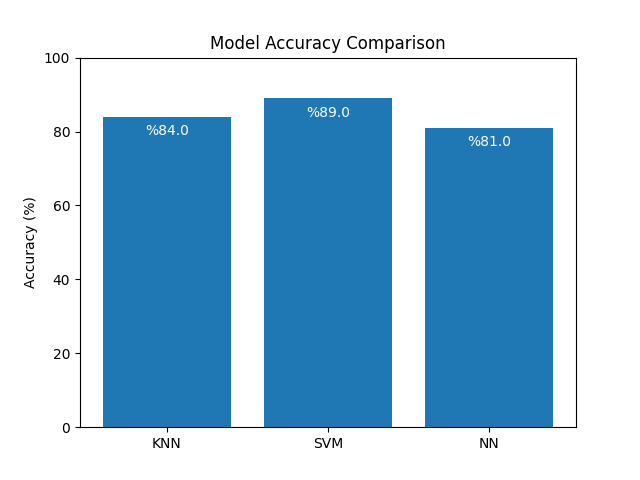

# Heart Disease Predictor

This project uses machine learning models to predict the presence of heart disease based on a dataset of medical features.

## Description

The application trains and compares three different ML models:

* **K-Nearest Neighbors (KNN)**
* **Support Vector Machine (SVM)**
* **Neural Network (MLPClassifier)**

Each model is trained on a preprocessed version of the heart disease dataset and evaluated using accuracy.

## Dataset

* UCI Heart Disease Dataset  
* [https://archive.ics.uci.edu/ml/datasets/heart+disease](https://archive.ics.uci.edu/ml/datasets/heart+disease)
